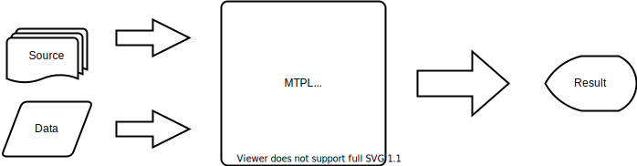
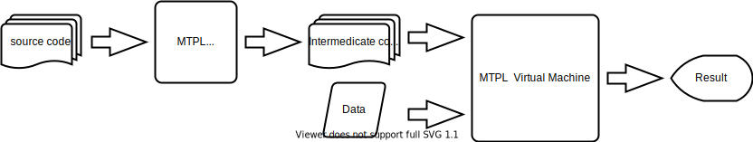

# MTPL Architecture

## 1 overview

### 1.1 Interpreter

### 1.2 Language processing system

### 1.3 The architecture of MTPL
According the chapter 1.1 and 1.2, you should know the MTPL is a programming language processing system of MT programming language.  
Although it have intermediate code like Java.

MTPL have 5 parts: Lexical analyzer, Parser analyzer, Semantic analyzer, Intermediate code generator and Virtual machine.

## 
source code -> lexical analyzer -> parser analyzer -> semantic analyzer -> intermediate code generator

